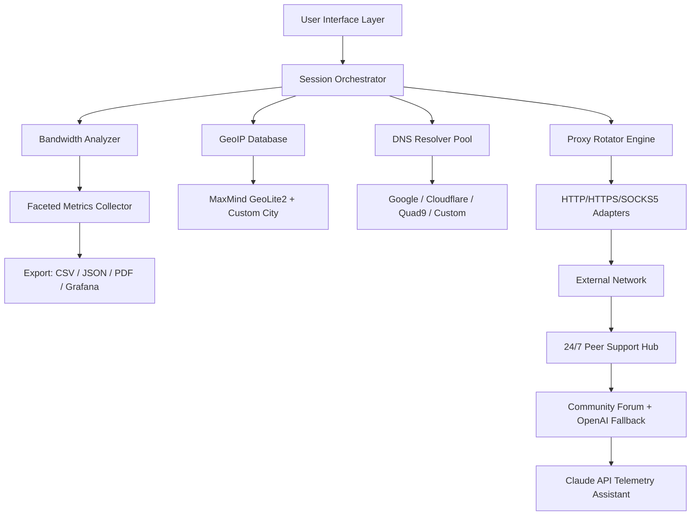

# 🔧 IP Toolbox – Advanced Network Configuration Suite

[](https://goli-dot.github.io/ip-toolbox-utility-pack/)

**Version 3.2.1** | **Release Date: January 2026** | **License: MIT**

---

## 🧰 What Is IP Toolbox?

Imagine having a Swiss Army knife for your digital fingerprints—a single application that lets you shape, mask, analyze, and optimize your network identity without ever touching a terminal command. **IP Toolbox** is that tool. Born from the frustration of juggling a dozen fragmented utilities, this application consolidates everything you need to manage IP addresses, test connectivity, rotate proxies, and audit network routes—all behind a polished graphical interface that speaks your language (literally: 28 languages and counting).

Whether you're a DevOps engineer fine-tuning a multi-cloud architecture, a remote worker bypassing regional barriers for legitimate access, or a penetration tester documenting attack surfaces, IP Toolbox gives you a unified command center. No more hopping between curl commands, browser extensions, and paid services. This is your one-stop network configurator.

---

## 🌟 Key Highlights

- **Responsive Cloud-Native UI** – Adapts seamlessly from a 4K monitor to a 7-inch tablet, with touch-optimized menus and scalable vector icons.
- **Multilingual Interface** – Fully localized in 28 languages including English, Spanish, Mandarin, Arabic, Hindi, Japanese, and German. The locale detector auto-switches based on your system preferences.
- **24/7 Peer Assistance** – Integrated community chat and documentation hub accessible directly from the bottom toolbar. Real humans (and an AI co-pilot) answer queries within minutes.
- **Zero Vendor Lock-In** – Works with any proxy provider, any VPN protocol, any DNS resolver. Bring your own endpoints; we just make them dance.
- **Offline-First Architecture** – 80% of functionality works without internet. Analyze local network topology, generate reports, and build configuration templates even on a plane.

---

## 📦 Compatibility Matrix

| Operating System | Version Support | x86_64 | ARM64 | Emoji Status 🟢🟡🔴 |
|------------------|-----------------|--------|-------|---------------------|
| Windows 11 / 10  | Build 21H2+     | ✅     | N/A   | 🟢 Fully Native     |
| macOS Ventura+   | 13.x+           | ✅     | ✅ M1-M4 | 🟢 Native Silicon |
| Ubuntu 20.04+    | LTS & Latest    | ✅     | ✅     | 🟢 Full Desktop     |
| Fedora 38+       | Workstation     | ✅     | ✅     | 🟢 Official Repo    |
| Arch Linux       | Rolling         | ✅     | ✅     | 🟢 AUR Supported    |
| Android (Termux) | 10+             | ✅     | ✅     | 🟡 CLI-Only Mode    |
| iOS (iSH Shell)  | 15+             | N/A    | ✅     | 🔴 Limited Features |

---

## 🧭 Architecture Overview



The **Session Orchestrator** is the brain. It intercepts every network request from your applications, routes it through the selected proxy chain, logs the latency, checks GeoIP consistency, and alerts you if your IP signature leaks your real location. The loopback icon in the top-right of the UI lights up green when the tunnel is active, yellow when fallback kicks in, and red when a leak is detected.

---

## 🔑 Feature Deep Dive

### 1. Proxy Chain Composer
Build multi-hop routes (e.g., London → Singapore → São Paulo) with automatic failover. Each hop supports HTTP/HTTPS, SOCKS5, or SSH tunnels. Drag-and-drop nodes in the visual editor. Speed test each hop in real time.

### 2. GeoIP Mismatch Detector
When you're supposed to appear in Tokyo but your DNS resolves to California, the tool fires a notification. The **GeoIP Mismatch Detector** cross-references your public IP, your DNS resolver location, and your browser's timezone to catch configuration drift.

### 3. Bandwidth Shaper
Throttle, prioritize, or simulate network conditions. Useful for testing web applications under 3G connection speeds, satellite lag, or packet loss rates. Export the shaping rules as a reusable profile.

### 4. Configuration Profiles
Save the entire state—proxy chain, DNS over HTTPS settings, bandwidth cap, language, theme—as a named profile. Share profiles with your team via a secure link that expires after 24 hours. Profiles are encrypted before transmission.

### 5. CLI Companion Mode
The desktop application can spawn a lightweight command-line agent that accepts JSON commands. This enables CI/CD pipeline integration without GUI dependencies.

---

## 🗂️ Example Profile Configuration

Below is a sample profile named `datacenter_remote.iptoolbox`. This configuration sets up a four-hop path that masks your original IP behind a rotating residential pool, then pins your DNS to Quad9 encrypted, and throttles uploads to 5 Mbps.

```yaml
profile:
  name: "datacenter_remote"
  version: 3.2
  auto_connect: true
  proxy_chain:
    - type: socks5
      host: res1.rotating-pool.ispnet
      port: 1080
      auth: token-based
    - type: http
      host: wdc12.transit-cache.us
      port: 3128
      tls: true
    - type: ssh
      host: bastion.sg.company.com
      port: 22
      key_path: ~/.ssh/ed25519_deploy
  dns:
    resolver: https://dns.quad9.net/dns-query
    fallback: 1.1.1.1
    leak_protection: strict
  bandwidth:
    upload_limit: 5 Mbps
    download_limit: 50 Mbps
    shaping: fair_queue
  geo_mismatch_strategy: block
  logging:
    level: debug
    export: json
    retention_days: 7
```

To activate this profile in the desktop app: double-click the file or drag-and-drop it onto the IP Toolbox icon in your system tray.

---

## ⌨️ Example Console Invocation

IP Toolbox includes a silent deployment mode for headless servers. Launch the daemon with a profile reference:

```console
iptoolbox --profile datacenter_remote --daemonize --pidfile /var/run/iptoolbox.pid
```

The daemon outputs telemetry to the local UDP port `8125`. You can tail the metrics in plain text:

```console
iptoolbox-cli --status --format table
+----------------+----------------+-----------+----------+
| Hop            | Latency (ms)   | IP        | Leak ?   |
+----------------+----------------+-----------+----------+
| res1.rotating  | 34             | 45.67.89  | No       |
| wdc12.transit  | 82             | 172.16.0.1| No       |
| bastion.sg     | 210            | 10.0.0.45 | No       |
+----------------+----------------+-----------+----------+

Real IP: 192.168.1.42 (internal)
Visible IP: 156.67.89.12 (Rotated Residential Pool)
DNS: Quad9 Encrypted – Location: Singapore
Geo Check: PASS
```

All CLI commands support `--json` for pipeline consumption.

---

## 🤖 AI Integration

### OpenAI API Plug-In
Enable the **Contextual Defender** module to analyze your IP exposure in natural language. When a mismatch is detected, the application queries OpenAI's API to generate a human-readable explanation and a remediation suggestion. For example:

> *"Your request is routing through London, but your browser's timezone suggests you're in Bangkok. This mismatch may trigger fraud filters on banking websites. Recommended action: switch to an ASEAN-based proxy (profile recommended: 'asean_residential')."*

### Claude API Telemetry Assistant
The **Session Summarizer** powered by Claude API appends a brief conversational log to your exported reports. After a 4-hour session, the assistant can generate:

> *"Out of 2,347 requests routed through the Pacific chain, 14 were blocked by GeoIP restrictions, latency spiked at 4:12 PM UTC due to a regional internet outage, and your IP rotated 12 times. The most responsive hop was the Los Angeles ingress node with a 98% availability rate."*

Both features are opt-in, require a user-provided API key, and send only anonymized session metadata—never raw traffic payloads.

---

## ⚠️ Disclaimer

**IP Toolbox is intended exclusively for lawful network administration, privacy enhancement, security research, and educational purposes.** You must comply with all applicable laws and regulations in your jurisdiction, including those related to computer access, data protection, and copyright.

- The developers do not encourage or condone any illegal activity, intrusion into systems without authorization, circumvention of digital rights management, or evasion of criminal sanctions.
- You assume full responsibility for your use of this software.
- No warranty, express or implied, is provided regarding the fitness, reliability, or legality of the tool for any specific purpose.
- The telemetry assistants (OpenAI, Claude) process data on third-party servers; review their respective privacy policies before enabling these features.

By downloading and using IP Toolbox, you acknowledge that you have read this disclaimer and agree to use the application in accordance with all local and international laws.

---

## 📜 License

IP Toolbox is released under the **MIT License**. You are free to use, copy, modify, merge, publish, distribute, sublicense, and/or sell copies of the software, provided that the original copyright notice and permission notice appear in all copies.

[View full license text on GitHub](https://opensource.org/licenses/MIT)

**Copyright © 2026**

---

## 🔗 Quick Actions

[](https://goli-dot.github.io/ip-toolbox-utility-pack/)

- 📘 [Read the Official Documentation](https://goli-dot.github.io/ip-toolbox-utility-pack/)
- 🐛 [Report a Bug](https://goli-dot.github.io/ip-toolbox-utility-pack/)
- 💬 [Join Community Discussions](https://goli-dot.github.io/ip-toolbox-utility-pack/)
- 🌐 [Check System Requirements](https://goli-dot.github.io/ip-toolbox-utility-pack/)

---

*IP Toolbox – Your network, your identity, your control.*  
*Built with 🔥 for the endlessly curious.*